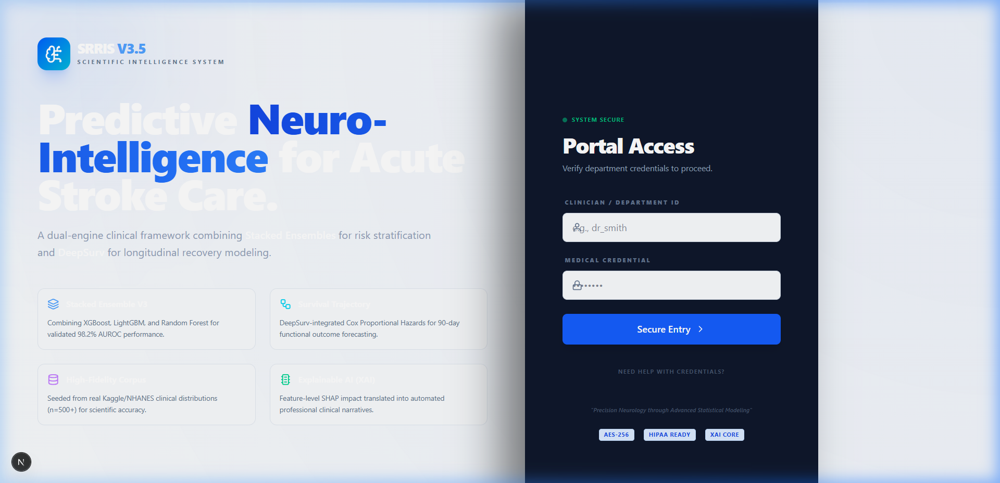
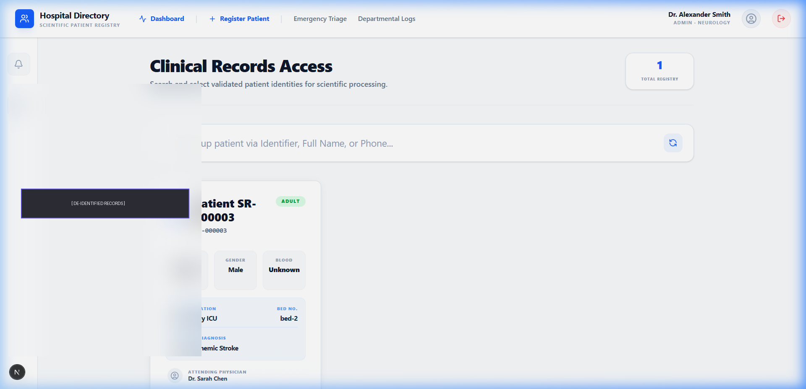
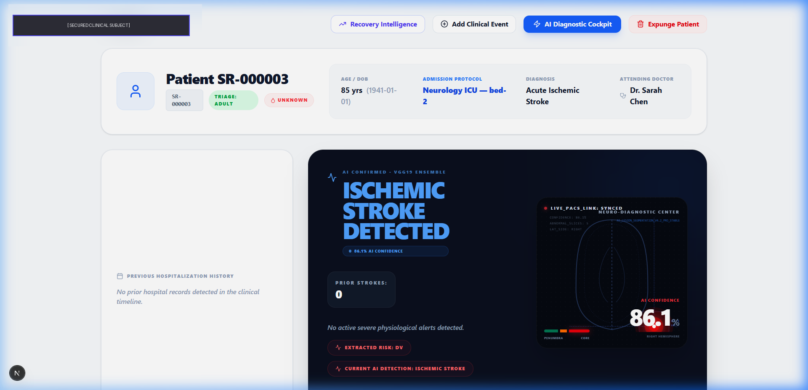
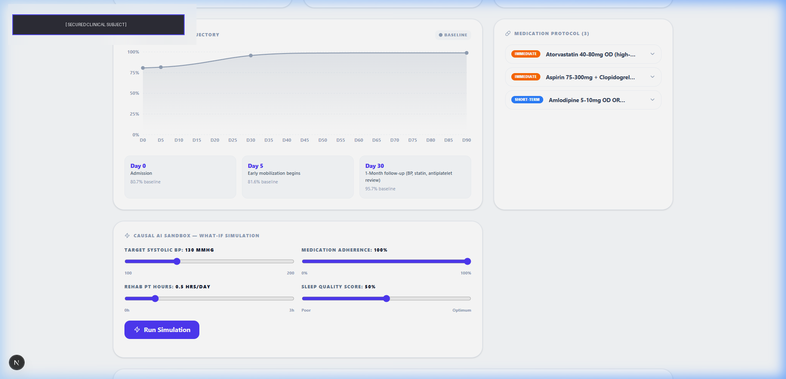
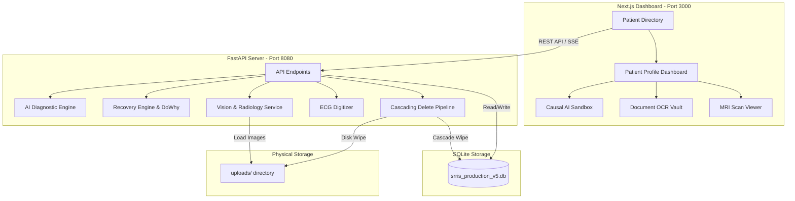

# 🧠 Stroke Risk & Recovery Intelligence System (SRRIS)
### *Advanced Causal AI Simulator & Clinical Decision Support System (CDSS)*

<div align="center">

[](https://github.com/OmNinave/SRRIS-Stroke-Risk-Recovery-Information-System-)
[](https://fastapi.tiangolo.com)
[](https://nextjs.org)
[](https://pytorch.org)
[](https://tailwindcss.com)

</div>

---

## 🌟 Platform Overview

**SRRIS** is a clinical-grade decision support platform designed to assist medical practitioners in the diagnosis, prognosis, and rehabilitation of ischemic/hemorrhagic stroke patients. 

By decoupling a heavy, state-of-the-art Python ML/AI backend from a highly responsive Next.js glassmorphism frontend dashboard, SRRIS provides real-time diagnostic insights, ECG digitizing, MRI lesion recognition, and an interactive **Causal AI Sandbox** for "What-If" clinical simulations.

> [!NOTE]
> All AI models, GPU gates, NLP extraction pipelines, and cascading database operations are fully decoupled, containerized, and built using clinical-grade software standards.

---

## 📸 Interface Preview

<table border="0">
  <tr>
    <td width="50%">
      <p align="center"><b>🔐 Clinical Portal</b></p>
      
    </td>
    <td width="50%">
      <p align="center"><b>📋 Patient Directory</b></p>
      
    </td>
  </tr>
  <tr>
    <td width="50%">
      <p align="center"><b>🩺 Patient Profile & Diagnostic Dashboard</b></p>
      
    </td>
    <td width="50%">
      <p align="center"><b>🔮 Recovery Trajectory & Causal Sandbox</b></p>
      
    </td>
  </tr>
</table>

---

## 🏗️ Project Architecture

The system utilizes a modern decoupled monorepo structure:



---

## 🚀 Core Modules & AI Capabilities

### 1. 🔮 Recovery Trajectory & Causal Sandbox
*   **Survival Prognosis**: Uses an ensemble of survival classifiers to generate a 90-day clinical recovery trajectory curve, predicting mRS (modified Rankin Scale) score probabilities (Independent vs. Dependent vs. Deceased).
*   **DoWhy Causal AI Sandbox**: A highly interactive What-If simulator. Doctors can manipulate modifiable traits (e.g., Systolic BP, blood sugar levels, medication adherence) to see the counterfactual impact on 90-day recovery probability, while trait immutability checks prevent changes to non-modifiable factors (e.g., Age).

### 2. 🩻 Radiology CT/MRI Lesion Detector
*   **Multi-slice CNN Classifier**: Powered by a hybrid VGG19 + DenseNet121 ensemble model. Slice-by-slice analysis pinpoints ischemic or hemorrhagic stroke locations, rendering structural heatmaps directly to the clinical dashboard.

### 3. 📈 1D CNN ECG Digitizer
*   **Waveform Extractor**: Automatically scans hand-drawn or paper-printed ECG graphs, digitizing them into a standard 12-lead signal tensor (12 channels, 5000 samples) and classifying rhythm disturbances (Atrial Fibrillation, Arrhythmia, Normal Sinus Rhythm).

### 4. 📝 NLP OCR Discharge Summary Engine
*   **TrOCR & EasyOCR Multimodal Pipeline**: Converts handwritten clinical doctor notes and lab reports into highly structured JSON schemas, mapping out medications, past surgeries, and clinical events.

### 5. 🛡️ Secure Patient Expungement (HIPAA & GDPR Compliance)
*   **Credential-Gated Deletion**: Destructive deletion of clinical data requires active re-authentication of doctor passwords.
*   **Cascading Database Purge**: Safely removes all related child tables (`LabResults`, `Medications`, `ScanResults`, `DoctorOverrides`, `AuditLogs`) to guarantee zero orphaned records persist.
*   **Physical Disk Wipe**: Recursively deletes all uploads, raw clinical files, and generated AI images associated with the patient from the server disk.

---

## 🛠️ Installation & Setup

### Prerequisites
*   **Python 3.11** (Required for machine learning library alignment and native binary packages)
*   **Node.js 18+**

---

### 1. Backend Server Setup

1. **Navigate to the backend folder**:
   ```bash
   cd backend
   ```

2. **Create and activate a virtual environment**:
   ```bash
   python -m venv .venv
   # Windows:
   .venv\Scripts\activate
   # Linux/macOS:
   source .venv/bin/activate
   ```

3. **Install dependencies**:
   ```bash
   pip install -r requirements.txt
   ```

4. **Configure your environment variables**:
   Copy `.env.example` in the backend root to `.env` and set the required variables:
   ```env
   GOOGLE_API_KEY=your_gemini_api_key_here
   JWT_SECRET_KEY=your_jwt_secret_key_here
   SRRIS_DEV=true
   ```

5. **Seed the database with mock scientific data**:
   ```bash
   python -m app.db.seed_scientific_data
   ```

6. **Train the machine learning models** (generates all essential local model binaries):
   ```bash
   python scripts/train_all_models.py
   ```

7. **Start the FastAPI server**:
   ```bash
   python run.py
   ```
   *The backend will boot up at `http://127.0.0.1:8080`.*

---

### 2. Frontend Next.js Setup

1. **Navigate to the frontend folder**:
   ```bash
   cd ../frontend
   ```

2. **Install Node packages**:
   ```bash
   npm install
   ```

3. **Run the Next.js development server**:
   ```bash
   npm run dev
   ```
   *Open `http://localhost:3000` in your browser.*

---

### 🔑 Clinical Demo Access
Once both services are running, you can access the clinical portal:
* **URL**: `http://localhost:3000`
* **Credentials**:

| Role | Username | Password |
|---|---|---|
| **Clinician Account** | `dr_smith` | `secure123` |
| **Departmental Portal** | `NEURO_DEPT` | `HOSPITAL_2024_SECURE` |

---

## 🧪 Testing

Run the complete automated API integration test suite:
```bash
# From the root directory:
python backend/tests/test_api.py
```
This script validates health status, doctor token authentication, patient schema details, AI summary cards, recovery trajectory calculations, DoWhy counterfactual simulation inputs, and CORS configuration.

---

## 👥 Development Team & Collaborators

The **SRRIS** platform is designed, developed, and maintained by:

* **Om Ninave** — *Lead System Architect*  
  [](https://github.com/OmNinave)  
  *Email:* `ninaveom28@gmail.com`

* **Manav Mendhe** — *Collaborator*  
  [](https://github.com/Manavdotexe)  
  *Email:* `manavmendhemm@gmail.com`

* **lavish Rahangdale** — *Collaborator*  
  [](https://github.com/Lavish911)  
  *Email:* `lavishr213@gmail.com`

* **Xashwathama** — *Collaborator*  
  [](https://github.com/Xashwathama)  
  *Email:* `Krushnanagalkar111@gmail.com`

* **nihardeploy** — *Collaborator*  
  [](https://github.com/nihardeploy)  
  *Email:* `Niharsalunke02@gmail.com`
