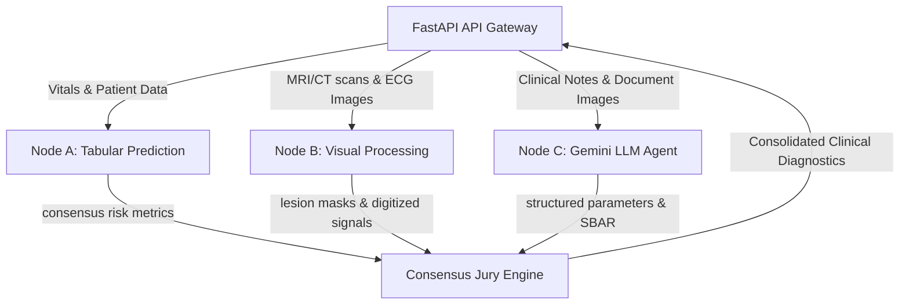

# 🧠 SRRIS Next-Gen: AI Hive Distributed Architecture

This directory houses the structural blueprint for upgrading the **Stroke Risk & Recovery Intelligence System (SRRIS)** backend from its current flattened structure to a **decentralized, modular multi-agent consensus network** known as the **AI Hive**.

---

## 1. Architectural Overview

The **AI Hive** is a conceptual framework designed to run predictions, radiological analysis, and LLM reasoning through independent, specialized nodes. Instead of importing all libraries and running all models within a single execution process, the AI Hive decouples operations into three distinct nodes:



---

## 2. Deep Dive: Node Specifications

### 🟢 Node A: Tabular Predictor (`node_a_tabular`)
*   **Role**: Handles structured patient records, clinical history, and demographic data.
*   **Key Models**:
    *   **XGBoost Classifier**: Fast gradient-boosted trees optimized for high precision on sparse medical tables.
    *   **Random Forest**: Multi-tree ensemble to prevent overfitting on clinical outliers.
    *   **Deep Artificial Neural Network (PyTorch)**: Fully connected deep layers to capture non-linear interactions between variables.
*   **Outputs**: Consensus probability score ($P_{\text{stroke}}$), feature importance metrics, and local SHAP explanations.

### 🔵 Node B: Visual Processing (`node_b_visual`)
*   **Role**: Handles high-dimensional radiological scans (MRI/CT) and digitized ECG paper recordings.
*   **Key Models**:
    *   **Graph Convolutional Network (GCN) / U-Net**: Segmenting the ischemic infarct core or hemorrhagic boundary.
    *   **VGG16/ResNet CNN**: Binary classification of stroke presence in MRI slices.
    *   **ECG Digitizer**: Converts physical paper scans of ECG signals into a 12-lead digital timeseries array ($1 \times 5000$).
*   **Outputs**: Segmented lesion polygon coordinates (passed to the frontend viewport) and quantitative stroke volume (mL).

### 🟡 Node C: Gemini LLM Agent (`node_c_gemini`)
*   **Role**: Generates clinical explanations, translates mathematical SHAP features into human-readable notes, and handles OCR.
*   **Key Integrations**:
    *   **Gemini 1.5 Pro / Flash APIs**: Translates structured outputs from Node A & Node B into professional medical hand-off summaries.
    *   **Structured Output Parser**: Enforces strict JSON schemas on raw medical texts.
*   **Outputs**: Automated SBAR (Situation, Background, Assessment, Recommendation) clinician handover notes.

---

## 🛠️ Step-by-Step Upgrade Implementation Plan

To migrate the current backend code to this architecture in the future, follow these steps:

### Step 1: Decentralize imports into subfolders
Currently, `backend/app/services/ai_engine.py` handles tabular prediction, SHAP explanation, and core logic. 
1. Create ` consensus_engine.py` inside `node_a_tabular/`. Move the XGBoost, Random Forest, and PyTorch NN loading/prediction logic there.
2. Create `mri_segmenter.py` and `ecg_digitizer.py` inside `node_b_visual/`. Move the image preprocessing and CNN inference logic there.
3. Create `sbar_generator.py` inside `node_c_gemini/`. Move the Gemini API calls and prompt-building logic there.

### Step 2: Set up independent microservice gateways (Optional)
If scaling to a high-concurrency hospital network:
* Wrap each node folder in a lightweight FastAPI router and run them as independent containerized microservices (e.g., Docker containers).
* Point the main `backend/app/main.py` gateway to communicate with these microservices using HTTP/REST or gRPC calls. This prevents heavy deep-learning visual models (Node B) from bottlenecking tabular prediction speeds (Node A).

### Step 3: Implement dynamic loading configurations
Update the main service loader in `backend/app/services/ai_engine.py` to check for active nodes:
```python
# Conceptual dynamic loader
import os

class AIHiveManager:
    def __init__(self):
        self.node_a_active = os.environ.get("USE_NODE_A", "true") == "true"
        self.node_b_active = os.environ.get("USE_NODE_B", "true") == "true"
        
    def get_consensus(self, patient_data):
        if self.node_a_active:
            from future_upgrades.ai_hive.node_a_tabular.consensus_engine import run_consensus
            return run_consensus(patient_data)
        return {"status": "Node A Offline"}
```

---

## 📈 System Advantages
1. **Fault Tolerance**: If the Gemini API experiences downtime, Node A and Node B can still compute risk and render segmentations without crashing the platform.
2. **Scalability**: Allows Node B (which requires heavy GPU acceleration for MRI segmentation) to run on a dedicated GPU instance, while Node A runs on a standard CPU node.
3. **Pristine Code separation**: Separates mathematical modeling code (scikit-learn, PyTorch) from web integration and presentation logic.
